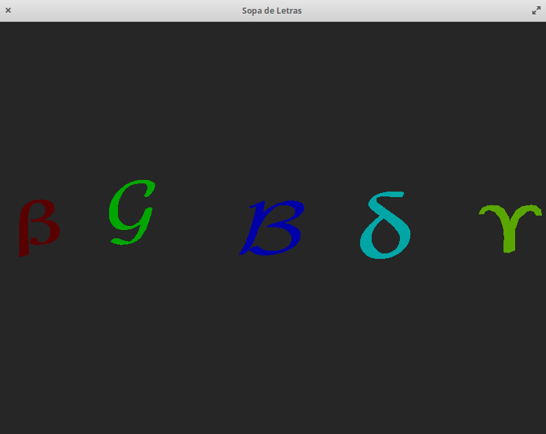
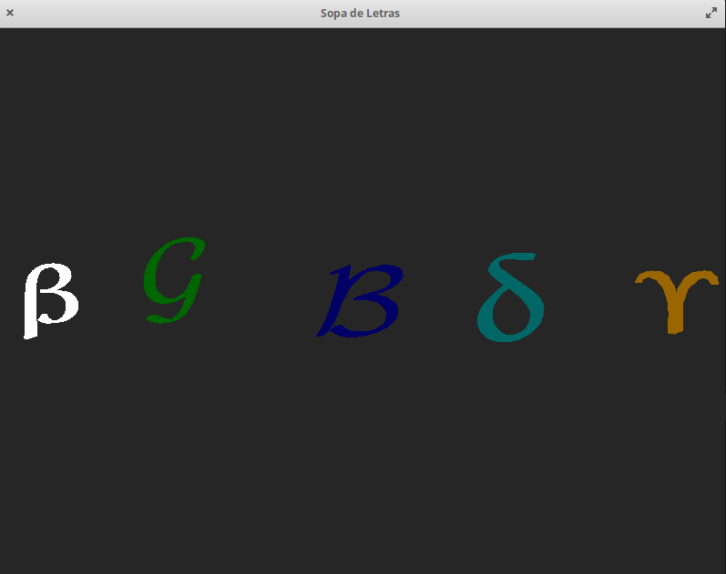
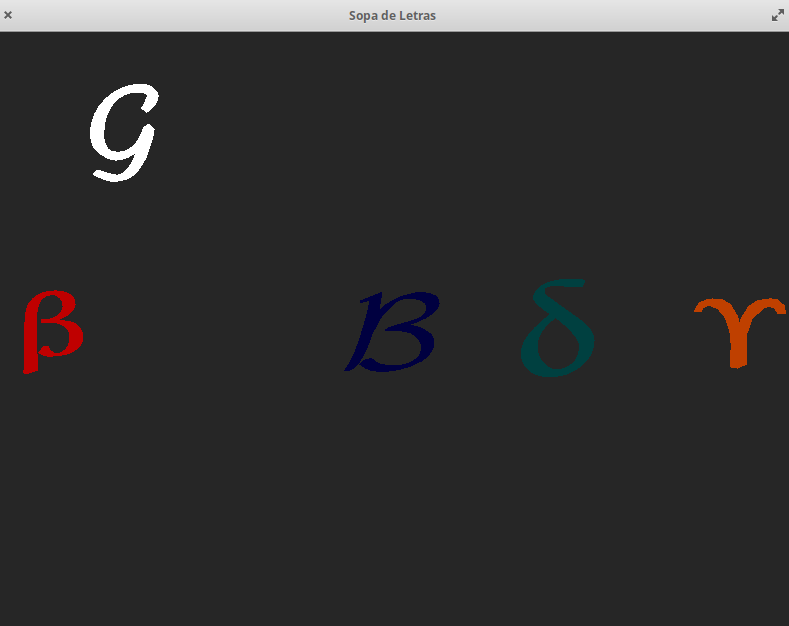
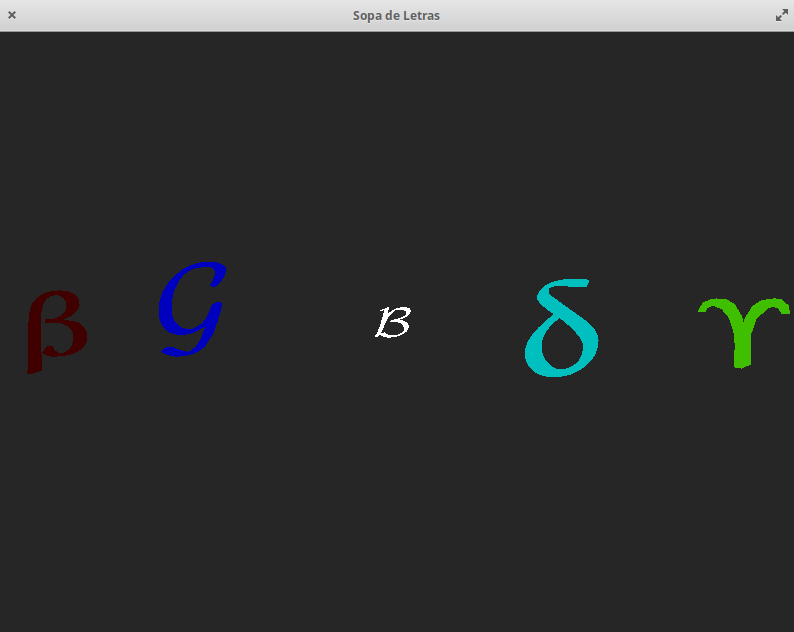
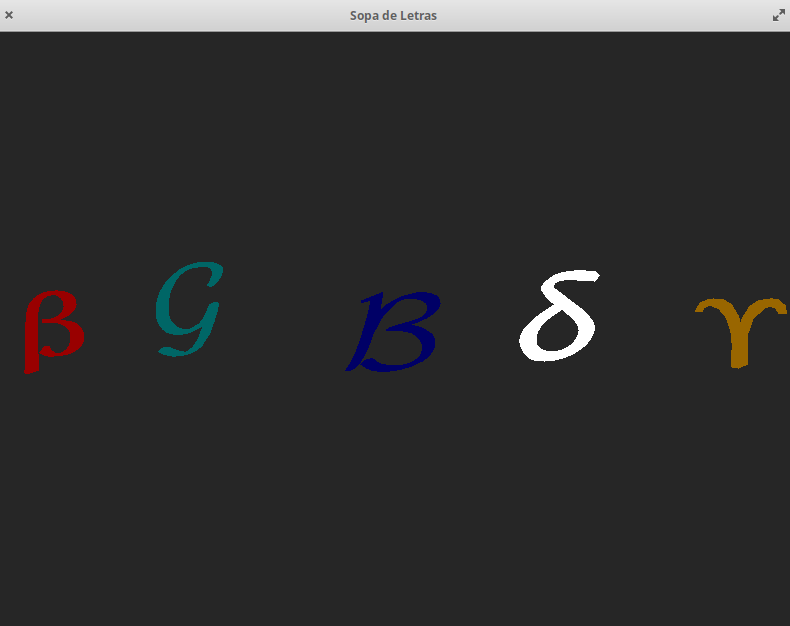
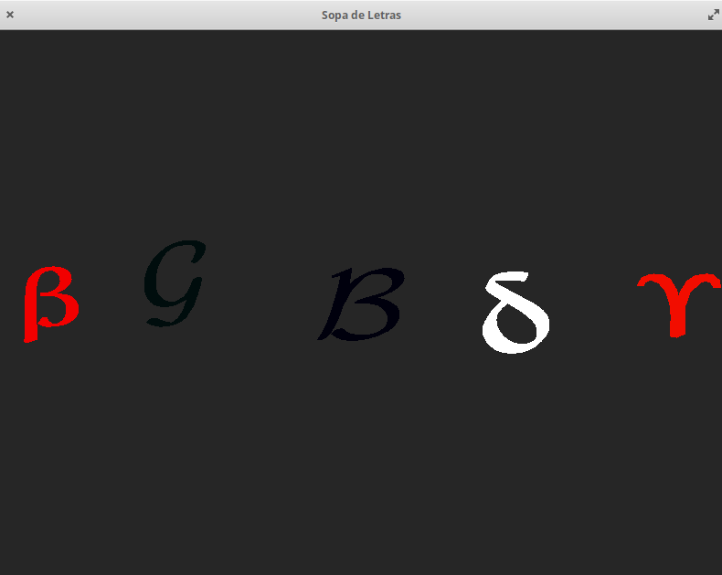
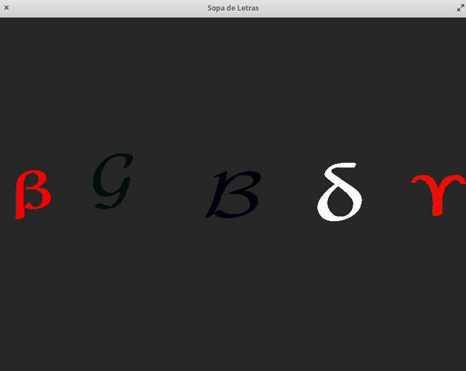
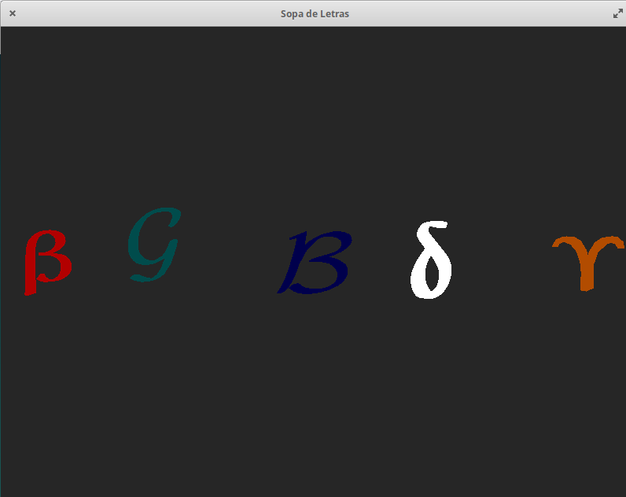
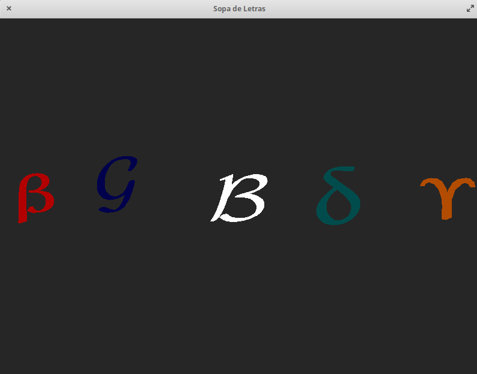

# Computação Gráfica - PL4 Sopa de Simbolos
> Ana Rocha, a63971 </p>
> Artur Rodrigues, a64592 </p>
> Ricardo Correria, a64007 </p>
> Jean Morelli, a64014 </p>
> Ruben Cruz, a64591</p>


## Objetivo
Mostrar os símbolos coloridos modelados a partir de triângulos. </p>

## Plataforma de Desenvolvimento
- [Github](https://github.com/AnaLuciaRocha/CG_Group)
    1. Clone repo
    - Chosse a folder where you want to work in your own env
    - Open console 
    - $ ```git clone https://github.com/AnaLuciaRocha/CG_Group.git```

- Sistema Operativo: ***Elementary***, versão 5.1.6 Hera (Distribuição Ubuntu)
- Compilador 
    ```
    gcc-10 | 10.1.0-2ubuntu1~18.04 | amd64 | GNU C compiler
    ```
    </p>
    
- Bibliotecas Necessárias
    1. glad.h
    2. glfw3.h
    3. iostrem
    4. glm.hpp
    5. glm/gtc/matrix_transform.hpp
    6. glm/gtc/type_ptr.hpp


## Resultados
- build: </P>
    **BUILD** </p>
    ```
    ana@caju:~/Documents/CG/build$ cmake -S .. -B .
    -- GLM is a header only library, no need to build it. Set the option GLM_TEST_ENABLE with ON to build and run the test bench
    -- Configuring done
    -- Generating done
    -- Build files have been written to: /home/ana/Documents/CG/build
    ```
    </P>

    **MAKE** </p>
    ```
    ana@caju:~/Documents/CG/build$ make
    [ 12%] Built target glfw
    [ 14%] Built target wave
    [ 16%] Built target simple
    [ 18%] Built target gears
    [ 20%] Built target boing
    [ 22%] Built target heightmap
    [ 24%] Built target splitview
    [ 27%] Built target offscreen
    [ 30%] Built target particles
    [ 32%] Built target sharing
    [ 35%] Built target title
    [ 37%] Built target timeout
    [ 40%] Built target monitors
    [ 43%] Built target clipboard
    [ 45%] Built target cursor
    [ 47%] Built target msaa
    [ 51%] Built target glfwinfo
    [ 54%] Built target threads
    [ 56%] Built target reopen
    [ 59%] Built target triangle-vulkan
    [ 61%] Built target opacity
    [ 64%] Built target iconify
    [ 66%] Built target gamma
    [ 69%] Built target events
    [ 71%] Built target icon
    [ 73%] Built target joysticks
    [ 76%] Built target windows
    [ 79%] Built target empty
    [ 82%] Built target inputlag
    [ 84%] Built target tearing
    [ 84%] Generating HTML documentation
    [ 84%] Built target docs
    [ 86%] Built target glad
    Scanning dependencies of target pl4
    [ 99%] Building CXX object pl4/CMakeFiles/pl4.dir/main.cpp.o
    [100%] Linking CXX executable pl4
    [100%] Built target pl4

    ```
    </P>
- run
    1. Para executar o progama corre-se o seguinte comando: ```ana@caju:~/Documents/CG/build$ ./pl4/pl4``` 

    2. Assim que o programa é executado aparece uma janela com o título *Letra 3D* com dimensão 800x600, como se pode ver na <a href="figura1">Figura 1</a> cuja simbolos  estao alinhados ao longo do eixo do x . </p> 
 
    <figure class="Figura">
    
    <figcaption>Figura 1 - Simbolos em Cena </figcaption>
    </figure>

    3. Os simbolos sao selecionados, pressionando as teclas `F1`, `F2`, `F3`, `F4` ou `F5`,respectivamente, para cada simbolo. O selecionado fica **Branco**, como se pode verificar na <a href="figura2">Figura 2</a>. </p> 

    <figure class="Figura">
    
    <figcaption>Figura 2 - Simbolo Beta selecionado </figcaption>
    </figure>


    3. Quando se seleciona o simbolo pode acontecer as seguintes situações: </p>
        <ol>
        <li>Movimento do Simbolo usando botao esquerdo do rato como se pode verificar na <a href="figura3">Figura 3</a> </li>
        
        <figure class="Figura">
        
        <figcaption>Figura 3 - Simbolo G selecionado e movimentado com o rato para cima e esquerda </figcaption>
        </figure>


        <li>Aproximação / Afastamento ao carregar no botão esquerdo e no botão + ou - do notepad, <a href="figura4">Figura 4</a> e <a href="figura5">Figura 5</a>, respetivamente . </li>

        <figure class="Figura">
        
        <figcaption>Figura 4- Simbolo B selecionado e afastado usando o '-' do notepad e pressionando com o botao esquerdo do rato </figcaption>
        </figure>

        <figure class="Figura">
        
        <figcaption>Figura 5 - Simbolo B selecionado e aproximado usando o '+' do notepad e pressionando com o botao esquerdo do rato </figcaption>
        </figure>

        <li>  Rotações </li>
        <ol>
        <li>  seta para “Cima” : roda sobre X (sent. horário) 10 graus. Assumimos que roda quando se pressiona a seta para cima, parando na posição final quando se deixa de pressionar a tecla </li>

        <figure class="Figura">
        
        <figcaption>Figura 6 - Simbolo Gamme selecionado rodado pressionando 3 vezes a seta para “Cima”  </figcaption>
        </figure>

        <li>  seta para “Baixo” : roda sobre X (sent. anti-horário) 10 graus </li>

        <figure class="Figura">
        
        <figcaption>Figura 7 - Simbolo Gamme selecionado rodado pressionando 3 vezes a seta para “Baixo”  </figcaption>
        </figure>


        <li>  seta para “Direita” : roda para a direita </li>
        
        <figure class="Figura">
        
         <figcaption>Figura 8 - Simbolo Gamme selecionado rodado pressionando 3 vezes a seta para “Direita”  </figcaption>
        </figure>

        <li>  seta para “Esquerda” : roda para a esquerda </li>

        <figure class="Figura">
        
           <figcaption>Figura 9 - Simbolo Gamme selecionado rodado pressionando 3 vezes a seta para “Esquerda”  </figcaption>
        </figure>


        <li>  tecla “a”: aumenta velocidade de rotação. Ao aumentarmos a velocidade de rotação quando voltarmos a premir as teclas anteriores, a rotação será maior  </li>

        <li>  tecla “z”: diminui a velocidade de rotação </li>

        </ol>


        <li> Reset da posição das letras ao longo do eixo dos x premindo a tecla “espaço” </li>

        <figure class="Figura">
        
        <figcaption>Figura 6 - Simbolo B estava selecionado e todos foram colocados na posiçao inicial </figcaption>
        </figure>
        </ol>