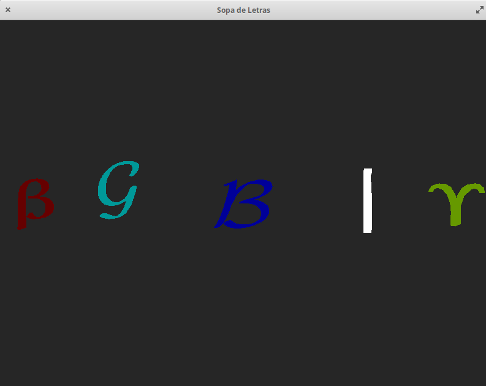
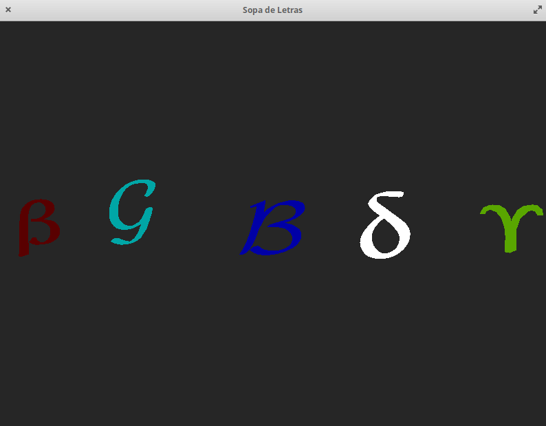

# Computação Gráfica - PL4 Soup Letter
> Ana Rocha, a63971 </p>
> Artur Rodrigues, a64592 </p>
> Ricardo Correria, a64007 </p>
> Jean Morelli, a64014 </p>
> Ruben Cruz, a64591</p>


## Objetivo
Show the letters modeled through triangles. </p>

## Development platform
- [Github](https://github.com/AnaLuciaRocha/CG_Group)
    1. Clone repo
    - Chosse a folder where you want to work in your own env
    - Open console 
    - $ ```git clone https://github.com/AnaLuciaRocha/CG_Group.git```

- OS: ***Elementary***, versão 5.1.6 Hera (Distribuição Ubuntu)
- Compiler 
    ```
    gcc-10 | 10.1.0-2ubuntu1~18.04 | amd64 | GNU C compiler
    ```
    </p>
    
- Ncessary libraries
    1. glad.h
    2. glfw3.h
    3. iostrem
    4. glm.hpp
    5. glm/gtc/matrix_transform.hpp
    6. glm/gtc/type_ptr.hpp


## Results
- build: </P>
    **BUILD** </p>
    ```
    ana@caju:~/Documents/CG/build$ cmake -S .. -B .
    -- GLM is a header only library, no need to build it. Set the option GLM_TEST_ENABLE with ON to build and run the test bench
    -- Configuring done
    -- Generating done
    -- Build files have been written to: /home/ana/Documents/CG/build
    ```
    </P>

    **MAKE** </p>
    ```
    ana@caju:~/Documents/CG/build$ make
    [ 12%] Built target glfw
    [ 14%] Built target wave
    [ 16%] Built target simple
    [ 18%] Built target gears
    [ 20%] Built target boing
    [ 22%] Built target heightmap
    [ 24%] Built target splitview
    [ 27%] Built target offscreen
    [ 30%] Built target particles
    [ 32%] Built target sharing
    [ 35%] Built target title
    [ 37%] Built target timeout
    [ 40%] Built target monitors
    [ 43%] Built target clipboard
    [ 45%] Built target cursor
    [ 47%] Built target msaa
    [ 51%] Built target glfwinfo
    [ 54%] Built target threads
    [ 56%] Built target reopen
    [ 59%] Built target triangle-vulkan
    [ 61%] Built target opacity
    [ 64%] Built target iconify
    [ 66%] Built target gamma
    [ 69%] Built target events
    [ 71%] Built target icon
    [ 73%] Built target joysticks
    [ 76%] Built target windows
    [ 79%] Built target empty
    [ 82%] Built target inputlag
    [ 84%] Built target tearing
    [ 84%] Generating HTML documentation
    [ 84%] Built target docs
    [ 86%] Built target glad
    Scanning dependencies of target pl4
    [ 99%] Building CXX object pl4/CMakeFiles/pl4.dir/main.cpp.o
    [100%] Linking CXX executable pl4
    [100%] Built target pl4

    ```
    </P>
- run
    1. The execute the program, you run the following command: ```PATH/CG/build$ ./pl4/pl4``` 

    2. As soon as the programi s executed, a window with the title "Letra 3D" with 800x600 dimension will show up, like you can see in <a href="figura1">Figura 1</a>, where the etters are aligned in the X axis. The letters flash, except for the selected one.

    <figure class="Figura">
    </p>
    <figcaption>Figura 1 - Simbolos em Cena </figcaption>
    </figure>

    3.Symbols are selected, pressings the keys `F1`, `F2`, `F3`, `F4` ou `F5`,respectively for each symbol. The selected one stays **white**, as seen in <a href="figura2">Figura 2</a>. This functionality is implemented via use of the function ```void selectLetter(GLFWwindow *window)``` </p> 
    

    <figure class="Figura">
    </p>
    <figcaption>Figura 2 - Simbolo Beta selecionado </figcaption>
    </figure>


    4. One you select a letter, one of the following things can be done : </p>
        <ol>
        <li>Movement of the letter using the left mouse button, as seen in <a href="figura3">Figura 3</a>. Implement using the function
        <i> void selectLetterGLFWwindow *window) </i> que chama  
        <i> void moveLetter(GLFWwindow *window) </i>  </li>
        
        <figure class="Figura">
        </p>
        <figcaption>Figura 3 - Simbolo G selecionado e movimentado com o rato para cima e esquerda </figcaption>
        </figure>


        <li> Approach / Des-approach by clicking in the '+' and '-' keys of the notepad, as seen in <a href="figura4">Figura 4</a> and <a href="figura5">Figura 5</a>, respectively. This functionality is implement using the function  <i>void selectLetterGLFWwindow *window)</i> which calls <i>void moveLetterOverZ(GLFWwindow *window, char symbol)</i> </li>

        <figure class="Figura">
        </p>
        <figcaption>Figura 4- Simbolo B selecionado e afastado usando o '-' do notepad e pressionando com o botao esquerdo do rato </figcaption>
        </figure> </p>

        

        <figure class="Figura">
        </p>
        <figcaption>Figura 5 - Simbolo B selecionado e aproximado usando o '+' do notepad e pressionando com o botao esquerdo do rato </figcaption>
        </figure>


        <li>  Rotations <i> void key_callback(GLFWwindow* window, int key, int scancode, int action, int mods)</i> </li>
        <ol>


        <li>  Key arrow “UP” : rotaves over the X axis (clockwise) 10 degrees. Uses the function  <i>void moveLetterOverX(GLFWwindow *window, char symbol) </i> </li>

        <figure class="Figura">
        </p>
        <figcaption>Figura 6 - Simbolo Gamme selecionado rodado pressionando 3 vezes a seta para “Cima”  </figcaption>
        </figure>

        <li>  Key arrow “Down”  :  rotaves over the X axis (anti clockwise) 10 degrees.  Uses the function <i>void moveLetterOverX(GLFWwindow *window, char symbol) </i> </li>

        <figure class="Figura">
        </p>
        <figcaption>Figura 7 - Simbolo Gamme selecionado rodado pressionando 3 vezes a seta para “Baixo”  </figcaption>
        </figure>


        <li>  Key arrow “Right”  : Rotates to the right over the Y axis, 10 degrees.  Uses the function <i>void moveLetterOverY(GLFWwindow *window, char symbol) </i> </li>
        
        <figure class="Figura">
        </p>
         <figcaption>Figura 8 - Simbolo Gamme selecionado rodado pressionando 3 vezes a seta para “Direita”  </figcaption>
        </figure>

        <li>  Key arrow “Left”  : Rotates to the left over the Y axis, 10 degrees.  Uses the function <i>void moveLetterOverY(GLFWwindow *window, char symbol) </i> </li>

        <figure class="Figura">
        </p>
           <figcaption>Figura 9 - Simbolo Gamme selecionado rodado pressionando 3 vezes a seta para “Esquerda”  </figcaption>
        </figure>


        <li>  Key “a”: Increases the degrees by which the rotation movements happens.  </li>

         <figure class="Figura">
        </p>
        <figcaption>Figura 10 - Simbolo Delta estava selecionado rodado depois de aumentar a velocidade de rotação pressionando 3 vezes a seta para “Direita” </figcaption>
        </figure>
        </ol>

        
        <li>  key “z”: Decreases the degrees by which the rotation movements happens. </li>

          <figure class="Figura">
        </p>
        <figcaption>Figura 11 - Simbolo Delta estava selecionado rodado depois de diminuir a velocidade de rotação pressionando 3 vezes a seta para “Direita” </figcaption>
        </figure>
        </ol>


        </ol>


        <li> Resets the letters along the X axis by pressing the "Space" key. Uses the function  <i>void reset_positions()</i> </li>

        <figure class="Figura">
        </p>
        <figcaption>Figura 12 - Simbolo B estava selecionado e todos foram colocados na posiçao inicial </figcaption>
        </figure>
        </ol>
